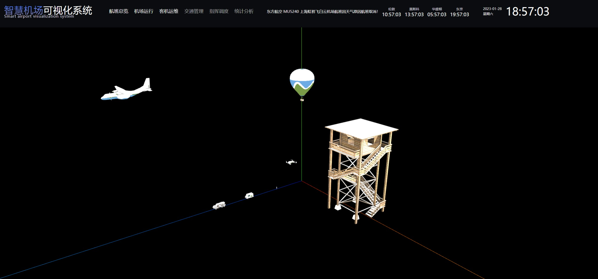
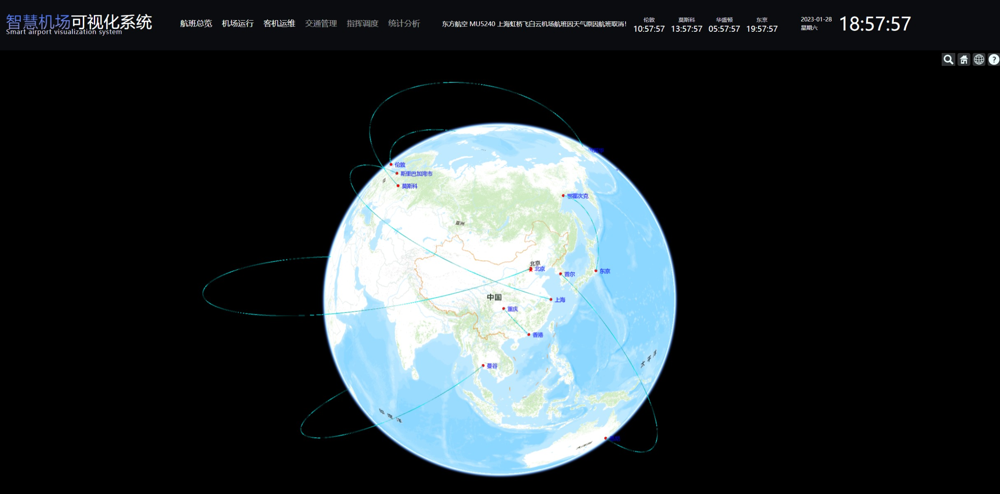

# smartairport

## Project setup
```
npm install
```

### Compiles and hot-reloads for development
```
npm run serve
```

### Compiles and minifies for production
```
npm run build
```


### 项目预览






仅个人学习练习demo，任何违法行为与本人无关

觉得还不错的可以点点star哦！！！

